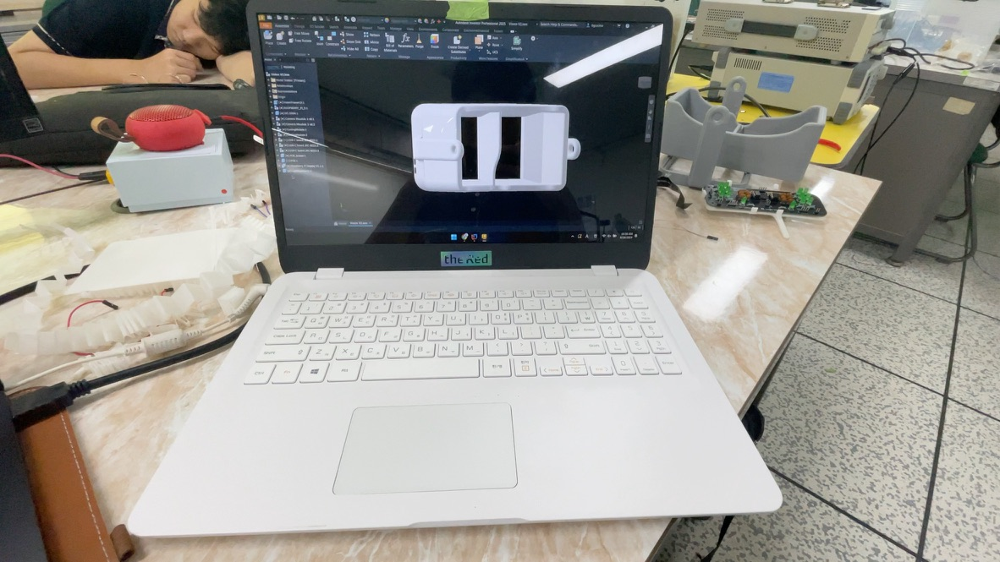

[//]: # (this description is temp for MDP announcement)

# **BL™ v1**

> **Blind Lumos**
>
> devMaxTrauma. Inc.™ presents **BL™ v1**

## 목차

> 1. [소개](#소개)
> 2. [대상 및 목적](#대상-및-목적)
> 3. [오픈소스](#오픈소스)
> 4. [기능](#기능)
> 5. [개발 과정](#개발-과정)
> 6. [알려진 문제](#알려진-문제)
> 7. [개발자들](#개발자들)

## 제품 소개

BL™ v1은 devMaxTrauma Inc.에서 개발한 혁신적인 시각 보조 기기로, 주로 시각장애인들을 위한 고급 기술을 탑재하고 있습니다. 이 제품은 OpenCV와 TensorFlow를 활용한 이미지 인식 기능과
FindMy 기능 등 다양한 편의 기능을 제공합니다.

BL™ v1의 소프트웨어는 오픈소스로 제공되며, 누구나 이를 참고하거나 수정할 수 있지만, 다음과 같은 조건이 적용됩니다:

> # BL™ v1 소프트웨어 사용 조건
>
> ---
>
> ## A. 출처 표기
> BL™ v1 소프트웨어를 사용할 때는 **반드시 devMaxTrauma Inc.와 BL™ v1의 출처를 명시**해야 합니다.  
> 출처가 명시되지 않을 경우, 해당 소프트웨어 사용 권한이 **즉시 상실**되며, 소프트웨어의 **소유권이나 지적 재산권을 주장할 수 없습니다**.
>
> ---
>
> ## B. 비상업적 및 윤리적 사용
> BL™ v1 소프트웨어는 **비상업적 목적**으로만 사용 가능하며, **비윤리적 사용**을 엄격히 금지합니다.  
> 상업적 목적으로 사용하려면 devMaxTrauma Inc.의 **사전 서면 승인**이 필요합니다.
>
> ---
>
> ## C. 수정 및 파생 소프트웨어
> BL™ v1 소프트웨어를 수정하거나 이를 기반으로 개발된 소프트웨어는 **본 라이선스 조건**을 그대로 따라야 하며,  
> devMaxTrauma Inc.는 해당 수정 소프트웨어에 대한 **소유권 및 라이선스 권한**을 보유합니다.
>
> ---
>
> ## D. 보증 및 책임
> BL™ v1 소프트웨어는 **"있는 그대로" 제공**되며, devMaxTrauma Inc.는 사용 중 발생하는 **어떠한 손해나 문제에 대해서도 책임을 지지 않습니다**.  
> 소프트웨어 사용으로 인해 발생하는 법적 분쟁, 손실, 또는 기타 불이익은 **사용자의 책임**입니다.
>
> ---
>
> ## E. 동의
> BL™ v1 소프트웨어를 다운로드, 설치 또는 사용할 경우, 위의 모든 조건에 **자동으로 동의**한 것으로 간주됩니다.
>
> ---

## 대상 및 목적

- 사람들은 보통 시각장애인이라 하면 전맹일 것이라 생각하지만, 실제로는 **전체 시각장애인 중 약 12%만이 전맹**이고, 나머지 88%는 색약이 있거나 시력이 떨어지는
  사람들입니다. [출처](http://www.kbufac.or.kr/Board/News/Detail?ContentSeq=2908&Page=19)
- **BL™은 전맹이 아닌 시각장애인들을 주 대상으로** 하며, 시각장애인의 불확실한 시각정보를 보완해주기 위해 제작한 작품입니다.
- 취약계층의 경제적 부담을 최대한 줄이며 보급률을 올리고자 제품 가격을 낮게 책정하여 설계했습니다. 대략 판매시 250,000 KRW 정도로 판매되길 희망합니다.

## 오픈소스

> ### EULA:
>
> BL™ v1을 개발하는 데 사용된 각종 소프트웨어 코드들은 모두 **오픈소스**로 제작되었습니다.  
> 이를 통해 누구나 이 프로젝트를 참고하거나 코드를 자유롭게 수정 및 재배포할 수 있습니다.  
> 다만, 이 프로젝트를 사용하는 모든 사용자는 다음 조건을 준수해야 합니다:
>
> ---
>
> 1. **출처 표기**
>> * 이 프로젝트를 참고하거나 수정된 코드를 배포할 때는 반드시 **devMaxTrauma Inc. 및 BL™ v1의 출처**를 명시해야 합니다.
>> * 출처를 명시하지 않을 경우, 귀하의 소프트웨어 사용 권한은 **즉시 상실**되며, devMaxTrauma Inc.가 귀하의 코드에 대한
>> * **소유권 및 라이선스 권한**을 행사할 수 있습니다.
>
> 2. **비도덕적 및 악용 금지**
>> * 이 프로젝트는 **비도덕적 목적**이나 **악의적인 의도**로 사용하는 것을 엄격히 금지합니다.
>> * 예를 들어, 불법적인 활동, 차별, 폭력 조장 등에 사용되는 경우 devMaxTrauma Inc.는 해당 사용자에 대해
>> * 법적 조치를 취할 권리를 보유합니다.
>
> 3. **수정 및 재배포**
>> * BL™ v1 기반으로 수정된 소프트웨어는 **동일한 라이선스 조건**을 따라야 합니다.
>> * 수정 및 재배포된 소프트웨어 또한 반드시 devMaxTrauma Inc.의 출처를 명시해야 하며,
>> * 이와 관련된 소유권은 devMaxTrauma Inc.에 귀속됩니다.
>
> ---
>
> ### 동의:
>
> 이 프로젝트를 다운로드, 수정, 재배포하거나 참여하는 행위만으로도 위의 모든 조건에 **자동으로 동의**한 것으로 간주됩니다.  
> devMaxTrauma Inc.는 본 프로젝트와 관련된 모든 지적 재산권과 법적 권리를 보유합니다.

### 작업결과들

- [S:IDE™](https://github.com/ellystargram/SIDE) - 자체개발 Code Editor, Kotlin 기반
- [rOS™](https://github.com/ellystargram/rOS) - Raspberry Pi 에서 돌아가는 텐서플로우 운영 체제
- [SLD™](https://github.com/devMaxTrauma/SLD) - FindMy기능을 활용할 수 있게 해주는 Android용 앱
- [devMaxTrauma. Inc.™](https://github.com/devMaxTrauma/Drive) - devMaxTrauma. Inc.의 모든 프로젝트 결과물

## 기능

> BL™ v1은 시각장애인의 시각정보를 보완해주는 제품입니다.

- BL™ v1은 라즈베리파이와 텐서플로우를 이용하여 사물을 인식하고, OpenCV를 이용하여 사물을 강조하여 표시합니다.
- SLD와 연동되어 안드로이드 기기에서 FindMy 기능을 사용할 수 있습니다.
- 탭틱엔진을 이용하여 햅틱 피드백을 얻을 수 있습니다.
- AR 기기답게 FPS 증진에 초점을 맞추어 최적화되었습니다. OpenCV Thread 와 Tensorflow Thread 를 병렬로 돌리며, 이를 통해 빠른 인식을 제공합니다.
- 물체와 사용자간의 거리를 측정하여 사용자에게 알려줍니다.

## 개발 과정

### 설계 단계때 Inventor 상에 설계된 모델

### 착용샷

### PCB

## 알려진 문제

- BL™ v1은 보기와 다르게 무거울 수 있습니다. 이는 MVP제품 특성상 발생하는 문제로, 이후 출시될 제품에서 개선될 예정입니다.
- BL™ v1은 시각장애인의 시각정보를 보완해주는 제품이지만, 시각장애인의 시각정보를 완벽하게 보완해주지는 못합니다. 이 점을 감안하여 사용해주시기 바랍니다.
- BL™ v1의 현재 디스플레이는 라즈베리파이 7인치 디스플레이로, 해상도가 낮고 명암비가 충분하지 않을 수 있습니다. 이는 다음 세대 제품에서 OLED 디스플레이를 탑제하면서 해결될 문제입니다.
- Light Seal™ 은 사람 체형에 맞춰서 커스텀으로 제작됩니다. 현제 착용하신 Light Seal 은 조원들중 한명의 얼굴을 본따 만들었기에 불편할 수 있습니다.
- Tensorflow Lite 모델이 부정확한 결과를 가져올 수 있습니다. 이는 AR 제품 특성상 FPS를 높이기 위해 모델을 최적화하다 보니 발생하는 문제입니다. 이는 다음 세대 제품에서 개선되길 희망합니다.

## 개발자들

### 최지오

> Role: Techno_King && Software Integrating Maestro

- 
- 
- 

### 송다연

> Role: Circuit Master

- 

### 최지훈

> Role: QC Master && Android Platform Sailor

- 
